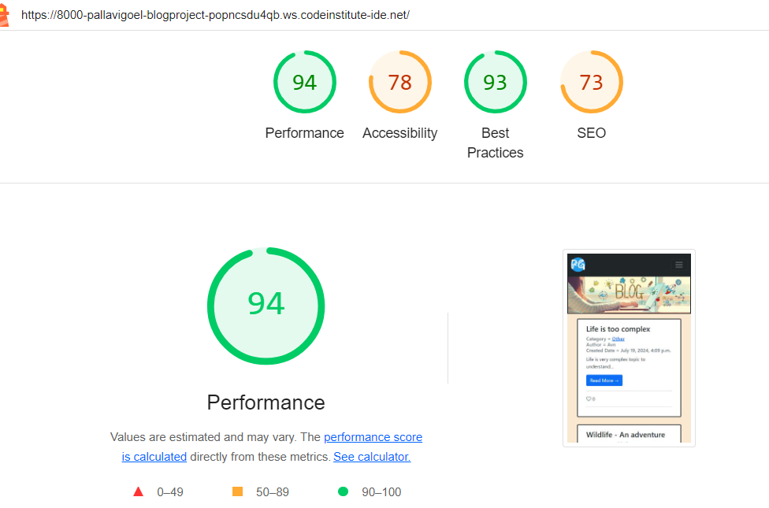

## BLOG App 

There are many among us who love to read and write blogs. A blog (or weblog) is an information, a person wants to share, on any topic which is expressed and explained by that person in his/her own words. This app is to provide a platform that can be used as blogs repository. There is possibility to read blogs, written by other persons as well. 

## Features

This app is to provide an easy way to create, maintain, share and read blogs written by users around the world. All you need is to create a user on the app in simple 2 steps and start blogging. At start, of course there wouldn't be much and I am working on to get links for the already existing blogs by different users on another webs.

## Home Screen

This is the very first screen that will be visible to the users once app is launched. on this page, there is a menu bar with option to login or register and list of existing blogs.

## Registration Screen

User will need to enter a username and select a password for this:

## Login Screen

An existing user can enter user id and password to login here:

## Add Blog Screen

There are few details needed to enter here for the user to add a blog. 

## Blog Screen

Once clicked on a blog, user can read the blog, can record reaction on the blog, also can leave a comment here.

## Add category Screen

There is a possibility to add category for the blog content via add category page

## Category list Screen

On this page, existing list of categories will be displayed

## Future Roadmap

Though the app is complete and functioning smoothly, there are still few improvement/enhancements can be added later. Few of them are:
1. More can be added to the blog, for example, entered date, validity, detailed category, etc
2. More information of the users can be gathered
3. Users can be notified when there is any like, comment or edit on their blog
4. Historical records can be displayed
5. Authentication on publications of blog can be included to restrict publication of inappropriate content

## Technologies Used

Following tools and technologies are used for this project:
Language: Python, CSS, HTML
Version Control: GitHub
Coding/Debugging: Gitpod
Deployment: Heroku
Framework: Django

### Deployment

Deployment of this project is done via Heroku. Steps followed are as follows:
1. Ensure that latest code changes are pushed to GitHub repository
2. Login to Heroku
3. Click on “Create New App”
4. Choose a unique name for the app and the region
5. Add build packs- Python and Nodejs (**Update this section**)
6. Go to 'Deploy' tab
7. Select GitHub as deployment method
8. Click connect
9. Enter GitHub repository name and search
10. Click connect
11. Click on deploy branch
12. Click on view app
13. App opened in new screen (**(https://miniblog23-f66148cb72c8.herokuapp.com/)**)

### Planning

For the planning of this project, Agile methodology is used. Entire project work was divided in small stories such as project can be developed, tested and presented at the end of each story. A story was moved through the workflow according to respective development was being performed. By the end of project, all the storied are moved to done.

## Quality Checks

Most of the testing is performed manually at various steps of development and repeated after completion of each story. Tests were included for functionality and GUI both.

### Validator Tests

All the code part of following files has been validated through the official W3C validator official Jigsaw validator

**list of html and css pages**

### Functional Tests

Functional tests performed for this app are as follows:
1. Navigation links are functioning
2. Posts are getting saved in database successfully
3. Information related to Blog is being populated correctly
4. Admin and non-admin logins are working as per authorization level defined
5. Different social media links are functioning

### GUI Tests

GUI tests performed for this app are as follows:
1. Text on all the pages is properly readable
2. All the images on different pages are correctly visible
3. Colour contrast on the pages is not weird
4. As a user, all information is readable 

### Lighthouse Test

Lighthouse application test results are here for this app

### Bugs

During development, I came across various issues and managed to fix them all by the end of project.

## Credits

I fetched help for coding from tutorial provided by Code Institute, boot strap, Django and Slack community. For logo creation Favicon been helpful resource for me. Also used free to access images from google search.

