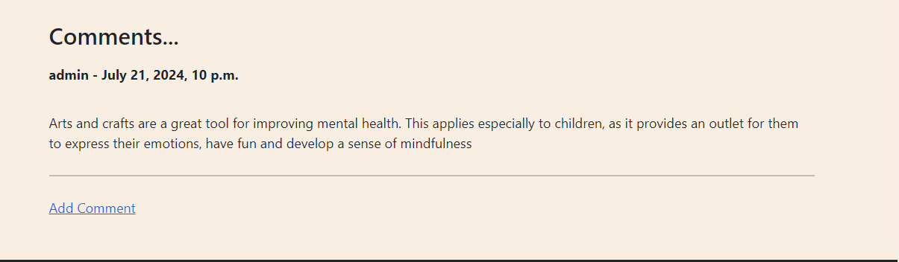

## BLOG App 

There are many among us who love to read and write blogs. A blog (or weblog) is an information, a person wants to share, on any topic which is expressed and explained by that person in his/her own words. This app is to provide a platform that can be used as blogs repository. As a user you can add as many blogs and as well on a number of different topics. Also, to make it more interesting, user can add images to their blog. There is possibility to read blogs, written by other persons as well. Also users have possibility to fetch list of blogs based on a specific category which can be selected from a list of many categories. 

## Features

This app is to provide an easy way to create, maintain, share and read blogs written by users around the world. All you need is to create a user on the app in simple 2 steps and start blogging. At start, of course there wouldn't be much and I am working on to get links for the already existing blogs by different users on another webs.

## Home Screen

This is the very first screen that will be visible to the users once app is launched. on this page, there is a menu bar with option to login or register and list of existing blogs.

## Registration Screen

User can register himself/herself to the website so the he/she can add blogs or can comment on existing blogs. In order to resigter, user will need to enter a username and select a password along with few other details:

## Login Screen

An existing user can enter user id and password to login here:

## Add Blog Screen

User can add a blog on this webside and can as well select the Slug and Snippet as well for their blod

## Blog View Screen

Once clicked on a blog, user can read the blog, can record reaction on the blog, also can leave a comment here.

## Edit Blog Screen

Users have possiblity to edit their blog as well as a author of the blog

## Comment View Screen

As a user, you can read comments on any of the blog added by any user on this website.

## Add Comment Screen

As a user, there is possibility to add comment to any of the blog avaiable on this website.

## Category list Screen

On this page, existing list of categories will be displayed

## Blogs list for selected Category

All available blogs for a specific category can be listed just by clicking the category

## Create Profile Screen

Registered users can create a profile here which will than be published on their blogs

## View Profile Screen

User's profile can be seen at their profile page as well on the blog added by that user

## Edit Profile Screen

User can edit their profile on this page

## Edit User Setting Screen

User can edit their user setting on this page

### Planning

For the planning of this project, Agile methodology is used. Entire project work was divided in small stories such as project can be developed, tested and presented at the end of each story. A story was moved through the workflow according to respective development was being performed. By the end of project, all the storied are moved to done.

## Wireframe

Flow of the website is as follows:

## Quality Checks

Most of the testing is performed manually at various steps of development and repeated after completion of each story. Tests were included for functionality and GUI both.

### Validator Tests

All the code part of following files has been validated through the official W3C validator official Jigsaw validator

### Manual Tests (Functioanl, GUI and UAT)

Tests performed for this app are as follows:

|ID|Test Case|Expected Result|Initial Status|Final Status|Defects|
|---------|---------|---------|---------|---------|---------|
|TC.01|Validate home page is loaded correctly when website is loaded|'Navigation bar is visible, Images are placed properly, Blogs can be viewed by scrolling on page, Social media links are visible|Pass|Pass||
|TC.02|Verify Blog list view at home page|There are 6 tiles of blogs visibe with Blog Title, Creation Date, Author, content and number of likes are visible for each blog|Fail|Pass|BUG.01|
|TC.03|Verify Paging is working|Next set of 6 Blogs is visible when clicked on Next|Pass|Pass||
|TC.04|Verify Blog detail view|Following information should be visible - Blog Title, Blog Category, Blog Author, Creation Date, Blog Content, Number of Likes, Autor's Profile, Comments|Fail|Pass|BUG.02, BUG.07|
|TC.05|Verify Category view|List of available categories should be displayed when clicked on category link from navigation bar|Fail|Pass|BUG.04|
|TC.06|Verify Blog view by category|All the blogs added for that category should be listed and user should be able to click on blog to get the Blog detail view|Fail|Pass|BUG.03, BUG.10|
|TC.07|Verify Registration page|A form with the list required information for registration should be displayed once user clicks Register navigation link|Pass|Pass||
|TC.08|Verify Registration|User should get registered once he/she filled the form with correct information and clicked on Register button|Pass|Pass||
|TC.09|Validate errors on Registration process|Correct error message should be populated to user in case of Duplicate username is entered|Pass|Pass||
|TC.10|Verify Login page|A form with the list required information for login should be displayed once user clicks Login navigation link|Pass|Pass||
|TC.11|Verify Login|User should be able to login once correct inforamtion is entered|Fail|Pass|BUG.05|
|TC.12|Validate errors on Login process|Correct error message should be populated to user in case of Username don't exists OR Password is wrong|Fail|Pass|BUG.06|
|TC.13|Validate comments without login|Anyone should be able to add comment on a post|Pass|Pass||
|TC.14|Verify creation of a blog|A user should be able to add a blog with all the required detail|Pass|Pass||
|TC.15|Validate editing a blog without login|Users should not have possibility to Edit or Delete the Blog without logging in|Pass|Pass||
|TC.16|Validate editing a blog with different login|Users should not have possibility to Edit or Delete the Blog from another author|Pass|Pass||
|TC.17|Validate editing a blog by author|Author should be able to edit his/her blog|Fail|Pass|BUG.08|
|TC.18|Validate deleting a blog by author|Author should be able to delete his/her blog|Pass|Pass||
|TC.19|Verify Create Profie|User should be able to create profile|Pass|Pass||
|TC.20|View Profile|Profile should be visible post creation|Fail|Fail|BUG.09|
|TC.21|Edit Profile|User should be able to eit profile|Pass|Pass||

### Lighthouse Test

Lighthouse application test results are here for this app

### Bugs

During development, I came across various issues and those can be found with latest status along with fixing comments as follows:

|ID|Summary|TestCase ID|Status|Resolution|
|----------|-------------------|----------|----------|--------------------|
|BUG.01|There is no paging available|TC.02|Fixed|Add paging code to the homepage.html|
|BUG.02|Blog Category is not visible in Blog Detail view|TC.04|Fixed|Add category information to post_detail.html|
|BUG.03|Text is wrong when no blog is available for category|TC.06|Fixed|Updated the message in categories.html|
|BUG.04|Category link is not working|TC.05|Fixed|Corrected te models.py and views.py with correct objects|
|BUG.05|Empty text boxes are displayed without any information as what to enter|TC.11|Fixed|Added respective text to the page at login.html|
|BUG.06|No error message displayed when entered wrong credentials|TC.12|NOt Fixed|Couldn't fix this even after taking support from technical team|
|BUG.07|Current user id is displayed instead of name|TC.04|Fixed|Removed respective code from the script|
|BUG.08|Update button is not visible correctly when editing a blog|TC.17|Fixed|Added a new line post button|
|BUG.09|Profile is not visible even after creating successfully|TC.20|Not Fixed|Couldn't fix this even after taking support from technical team|
|BUG.10|User is able to edit or delete blogs from another user at this page|TC.06|Fixed|Added condition to check if author and user are same|

## Future Roadmap

Though the app is complete and functioning smoothly, there are still few improvement/enhancements can be added later. Few of them are:
1. Users can be notified when there is any like, comment or edit on their blog
2. Authentication on publications of blog can be included to restrict publication of inappropriate content

## Technologies Used

Following tools and technologies are used for this project:
Language: Python, CSS, HTML
Version Control: GitHub
Coding/Debugging: Gitpod
Deployment: Heroku
Framework: Django

### Deployment

Deployment of this project is done via Heroku. Steps followed are as follows:
1. Ensure that latest code changes are pushed to GitHub repository
2. Login to Heroku
3. Click on “Create New App”
4. Choose a unique name for the app and the region
5. Add build packs- Python and Nodejs (**Update this section**)
6. Go to 'Deploy' tab
7. Select GitHub as deployment method
8. Click connect
9. Enter GitHub repository name and search
10. Click connect
11. Click on deploy branch
12. Click on view app
13. App opened in new screen (**(https://miniblog23-f66148cb72c8.herokuapp.com/)**)

## Credits

I fetched help for coding from tutorial provided by Code Institute, boot strap, Django and Slack community. For logo creation Favicon been helpful resource for me. Also used free to access images from google search.

